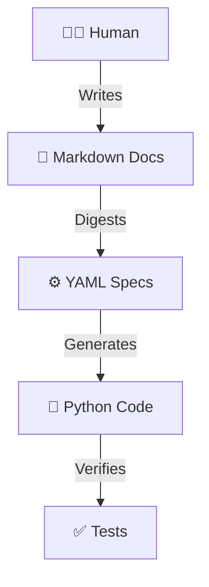

# DevSpec：AI原生开发协航系统

> **Product Requirements Document (PRD)**  
> Version: 4.0 (Document Driven Edition)  
> Status: **The Single Source of Truth**

---

## 1. 产品愿景

### 1.1 一句话定义

DevSpec 是一个 **文档驱动 (Document-Driven)** 的智能开发系统。
它将 **自然语言文档** 视为软件工程的唯一真理，通过 AI 自动“消化”文档来驱动代码的生成与演进。

### 1.2 核心哲学：瀑布流真理 (Waterfall Truth)

我们拒绝复杂的“双向同步”，坚持最符合人类直觉的**单向**工作流：



| 角色 | 职责 | 真理级别 |
|------|------|----------|
| **Human** | 撰写/修改 Markdown 文档 | **L0: 唯一真理 (Origin)** |
| **DevSpec** | 解析文档 → 生成配置 (YAML) | **L1: 中间态 (Intermediate)** |
| **DevSpec** | 读取配置 → 生成代码 (Code) | **L2: 投影 (Projection)** |

### 1.3 不做什么

```
❌ 不允许直接修改 YAML 规格（那是生成物）
❌ 不允许直接修改业务代码（除非是 Hotfix 且事后必须补文档）
❌ 不做复杂的“代码反向同步文档”（Code Reconcile）
```

---

## 2. 核心功能模块

### 2.1 M1: 文档消化引擎 (Doc Digester)
**这是系统的核心心脏。**

*   **输入**: `.specgraph/documents/` 下的 Markdown 文件。
*   **能力**: 
    *   智能识别文档中的 Feature 定义、User Story 和 Workflow。
    *   自动提取并生成/更新 `.specgraph/features/*.yaml`。
*   **价值**: 让文档不再是“死文件”，而是可执行的“源代码”。

### 2.2 M2: 知识图谱 (SpecGraph)
*   **职责**: 存储由 M1 消化后的结构化数据。
*   **存储**: YAML (作为 Git 存储) + SQLite (作为查询加速)。
*   **注意**: 它不再是真理源头，而是文档的**结构化缓存**。

### 2.3 M3: 代码生成器 (Code Generator) (Planned)
*   **职责**: 读取 M2 中的 Feature/Component 定义，生成 Python 代码。
*   **原则**: Code is Projection. 如果代码错了，检查文档或生成逻辑。

---

## 3. 开发工作流 (The Workflow)

### 3.1 场景：添加新功能

1.  **Human**: 打开 `prd.md`，新增一个章节：
    ```markdown
    ### F1: 登录功能
    用户可以通过 GitHub OAuth 进行登录...
    ```
2.  **Human**: 运行 `devspec doc digest`。
3.  **System**: 
    *   分析文档变更。
    *   自动生成 `features/feat_login.yaml`。
4.  **System**: (未来) 自动生成 `auth_service.py`。

### 3.2 场景：需求变更

1.  **Human**: 发现登录逻辑有问题。
2.  **Human**: **修改文档**（而不是改代码！）。
    *   将 "GitHub OAuth" 改为 "Email/Password"。
3.  **Human**: 再次运行 `devspec doc digest`。
4.  **System**: 更新 YAML，并重新生成/调整代码。

---

## 4. 目录结构

```
project/
├── .specgraph/
│   ├── documents/       <-- 【唯一真理】(Human Zone)
│   │   ├── prd.md
│   │   └── api_guide.md
│   │
│   ├── features/        <-- 【中间产物】(Machine Zone - Generated)
│   │   └── feat_xxx.yaml
│   │
│   ├── components/      <-- 【中间产物】(Machine Zone - Generated)
│   │   └── comp_xxx.yaml
│   │
│   └── .runtime/        <-- 【索引缓存】
│
├── src/                 <-- 【代码投影】(Machine Zone - Generated)
└── tests/
```

---

## 5. 路线图 (Roadmap)

*   **Phase 1: Digester (当前)**
    *   实现 `devspec doc digest`。
    *   打通 Doc -> YAML 的链路。

*   **Phase 2: Structure**
    *   完善 Component 定义的自动生成。

*   **Phase 3: Coder**
    *   实现 YAML -> Code 的生成。

---
*End of PRD v4.0*
