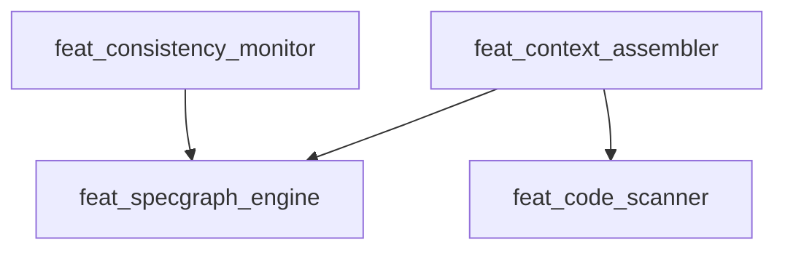

# DevSpec SpecGraph 图数据库架构演进方案

> **版本**: 0.5.0 (Implementation Ready)
> **日期**: 2024-12
> **状态**: 文档已完成，待实现
> **更新历史**:
> - v0.5.0: 完成所有 YAML 文件创建，PRD 更新完毕，进入编码阶段
> - v0.4.0: 移除 anchors 表，新增 Infrastructure Domain (dom_infra)
> - v0.3.0: 添加 Feature 依赖关系 (depends_on)
> - v0.2.0: 初始架构设计

---

## 0. 已完成的 YAML 文件清单

以下文件已根据本方案创建/更新：

### PRD 更新
- `PRD.md` - 新增 Section 6: Infrastructure Domain，更新版本至 0.3.0

### Product 更新
- `.specgraph/product.yaml` - 新增 dom_infra，更新版本至 0.2.0

### Feature 文件 (新增)
| 文件 | 说明 |
|------|------|
| `.specgraph/features/feat_specgraph_database.yaml` | 图数据库特性定义 |
| `.specgraph/features/feat_logging.yaml` | 日志特性定义 |
| `.specgraph/features/feat_config_management.yaml` | 配置管理特性定义 |
| `.specgraph/features/feat_error_handling.yaml` | 错误处理特性定义 |

### Component 文件 (新增)
| 文件 | 说明 |
|------|------|
| `.specgraph/components/comp_graph_database.yaml` | 图数据库核心组件设计 |
| `.specgraph/components/comp_graph_sync.yaml` | YAML 同步引擎组件设计 |
| `.specgraph/components/comp_graph_query.yaml` | 图查询引擎组件设计 |
| `.specgraph/components/comp_logger_factory.yaml` | 日志工厂组件设计 |
| `.specgraph/components/comp_config_manager.yaml` | 配置管理器组件设计 |
| `.specgraph/components/comp_error_handler.yaml` | 错误处理器组件设计 |

---

## 1. 问题分析

### 1.1 现有需求收集流程的问题

当前 `devspec-collect-req` 指令存在以下问题：

| 问题 | 描述 |
|------|------|
| **上下文加载不精确** | 一次性加载所有规则，而非按需分层加载 |
| **缺少自顶向下分析** | 没有从 Product Vision → Domain → Feature → Component 的渐进式分析流程 |
| **Domain 级别信息缺失** | 当前 Domain 嵌套在 `product.yaml` 中，无法单独存储 API 接口和详细定义 |
| **跨 Domain 协作困难** | 涉及多 Domain 配合的需求，无法方便地加载相关 Domain 的 API 定义 |
| **全文件扫描效率低** | 每次都要遍历 `.specgraph/` 目录，无法快速定位相关节点 |

### 1.2 理想的需求分析流程

```
用户需求
    ↓
[1] 加载需求分析原则 (des_architecture.yaml)
    ↓
[2] 加载 Product Vision (product.yaml)
    ↓  判断需求是否符合 Vision
[3] 分析涉及的 Domain (按需加载 Domain 信息)
    ↓  如果涉及多 Domain，加载相关 Domain 的 API
[4] 分析涉及的 Feature (按需加载 Feature 信息)
    ↓  可能是新 Feature，不需要加载
[5] 分析涉及的 Component (按需加载 Component 信息)
    ↓
[6] 生成分解结果和更新建议
```

### 1.3 核心痛点

> **痛点**: 当前 SpecGraph 是"扁平文件集合"，缺乏真正的图谱关系维护和高效查询能力。

---

## 2. 解决方案概述

### 2.1 架构演进目标

将 DevSpec 从 **"文件扫描模式"** 升级为 **"图数据库驱动模式"**：

```
+------------------+     同步      +------------------+     投影      +------------------+
|  PRD.md          | <----------> |  SQLite 图数据库  | <----------> |  源代码          |
|  (意图层)         |              |  (关系层)         |              |  (实现层)        |
+------------------+              +------------------+              +------------------+
        ↑                                ↑                                ↑
        |                                |                                |
        +--------------------------------+--------------------------------+
                                         |
                              .specgraph/*.yaml (持久化存储)
```

### 2.2 双模态存储策略

| 存储模式 | 用途 | 特点 |
|----------|------|------|
| **YAML 文件** | Git 友好的持久化存储 | 人类可读、版本控制、离线可用 |
| **SQLite 数据库** | 运行时图谱查询 | 高效索引、关系查询、按需加载 |

**同步原则**:
- YAML 是 **Source of Truth** (事实来源)
- SQLite 是 **Runtime Cache** (运行时缓存)
- 任何 YAML 修改后，通过 `devspec sync` 重建数据库

---

## 3. 数据模型设计

### 3.1 核心实体 (Entities)

```
┌─────────────────────────────────────────────────────────────────┐
│                        SpecGraph 实体模型                        │
├─────────────────────────────────────────────────────────────────┤
│                                                                 │
│  ┌─────────┐                                                    │
│  │ Product │ (L-1: 产品根节点)                                   │
│  └────┬────┘                                                    │
│       │ contains                                                │
│       ▼                                                         │
│  ┌─────────┐                                                    │
│  │ Domain  │ (L0: 战略领域) ←── 新增独立实体                      │
│  └────┬────┘                                                    │
│       │ owns                                                    │
│       ▼                                                         │
│  ┌─────────┐                                                    │
│  │ Feature │ (L1: 用户价值单元)                                  │
│  └────┬────┘                                                    │
│       │ realized_by          ┌─────────┐                        │
│       │    ┌─ depends_on ──→ │ Feature │ (前置依赖)              │
│       ▼    │                 └─────────┘                        │
│  ┌───────────┐                                                  │
│  │ Component │ (L2: 代码设计)                                    │
│  └─────┬─────┘                                                  │
│        │ binds_to                                               │
│        ▼                                                        │
│  ┌──────────┐                                                   │
│  │ CodeFile │ (L3: 代码符号) ←── 由 Scanner 自动维护              │
│  └──────────┘                                                   │
│                                                                 │
│  辅助节点:                                                       │
│  ┌─────────┐  ┌───────────┐  ┌────────────┐                     │
│  │ Design  │  │ Substrate │  │ DataModel  │                     │
│  └─────────┘  └───────────┘  └────────────┘                     │
│                                                                 │
└─────────────────────────────────────────────────────────────────┘
```

### 3.2 SQLite 表结构设计

#### 3.2.1 节点表 (nodes)

```sql
CREATE TABLE nodes (
    id TEXT PRIMARY KEY,           -- 节点 ID (如 dom_core, feat_scanner)
    type TEXT NOT NULL,            -- 节点类型 (product, domain, feature, component, design, substrate, code_file)
    name TEXT NOT NULL,            -- 人类可读名称
    description TEXT,              -- 描述
    source_file TEXT,              -- 来源 YAML 文件路径
    source_anchor TEXT,            -- PRD 锚点 (如 PRD.md#feat_scanner)
    intent TEXT,                   -- 意图 (L1/L2 节点)
    file_path TEXT,                -- 绑定的代码路径 (Component/CodeFile)
    content_hash TEXT,             -- 内容哈希 (用于变更检测)
    raw_yaml TEXT,                 -- 原始 YAML 内容 (JSON 格式)
    created_at TIMESTAMP DEFAULT CURRENT_TIMESTAMP,
    updated_at TIMESTAMP DEFAULT CURRENT_TIMESTAMP
);

CREATE INDEX idx_nodes_type ON nodes(type);
CREATE INDEX idx_nodes_source_file ON nodes(source_file);
CREATE INDEX idx_nodes_file_path ON nodes(file_path);
```

#### 3.2.2 边表 (edges)

```sql
CREATE TABLE edges (
    id INTEGER PRIMARY KEY AUTOINCREMENT,
    source_id TEXT NOT NULL,       -- 源节点 ID
    target_id TEXT NOT NULL,       -- 目标节点 ID
    relation TEXT NOT NULL,        -- 关系类型
    metadata TEXT,                 -- 额外元数据 (JSON)
    created_at TIMESTAMP DEFAULT CURRENT_TIMESTAMP,

    FOREIGN KEY (source_id) REFERENCES nodes(id) ON DELETE CASCADE,
    FOREIGN KEY (target_id) REFERENCES nodes(id) ON DELETE CASCADE,
    UNIQUE(source_id, target_id, relation)
);

CREATE INDEX idx_edges_source ON edges(source_id);
CREATE INDEX idx_edges_target ON edges(target_id);
CREATE INDEX idx_edges_relation ON edges(relation);
```

#### 3.2.3 关系类型定义

| 关系类型 | 源节点 | 目标节点 | 说明 |
|----------|--------|----------|------|
| `contains` | Product | Domain | 产品包含领域 |
| `owns` | Domain | Feature | 领域拥有特性 |
| `depends_on` | Feature | Feature | **Feature 前置依赖 (Explicit Dependency)** |
| `realized_by` | Feature | Component | 特性由组件实现 |
| `depends_on` | Component | Component | 组件技术依赖 |
| `binds_to` | Component | CodeFile | 组件绑定代码文件 |
| `exports` | Domain | DomainAPI | 领域导出的 API |
| `consumes` | Feature | DomainAPI | 特性消费的 API |
| `references` | Design | * | 设计决策引用的节点 |

> **注意**: 已移除 `anchored_at` 关系和 `anchors` 表，PRD 锚点信息通过 `nodes.source_anchor` 字段存储。

#### 3.2.4 Feature 依赖关系详解 (Explicit Dependency)

Feature 之间存在 **前置依赖 (depends_on)** 关系，但不存在 **实现关系**。

> **设计原则来源**: `des_architecture.yaml` 中的 `Explicit Dependency` 原则
> - Feature 之间只能通过 `depends_on` 建立依赖关系
> - 或者通过 Domain API 进行交互

**依赖类型区分**:

| 依赖类型 | 是否存在 | 说明 | 示例 |
|----------|----------|------|------|
| **实现依赖** | ❌ 不存在 | Feature A 不能由 Feature B "实现" (Atomicity Rule) | - |
| **前置依赖** | ✅ 存在 | Feature A 的运行需要 Feature B 已存在 | 上下文组装需要图谱引擎先存在 |
| **数据依赖** | ✅ 存在 | Feature A 消费 Feature B 产生的数据/能力 | 一致性监控需要读取图谱数据 |

**设计原则** (来自 des_architecture.yaml):
- **Atomicity Rule**: Feature (L1) 是不可再分的最小用户价值单元，禁止 Feature 嵌套
- **Explicit Dependency**: Feature 之间只能通过 `depends_on` 建立依赖关系
- 共享的技术实现应下沉到 Component 层，多个 Feature 可共享同一个 Component
- 跨 Domain 的 Feature 交互建议通过 Domain API 进行

**YAML Schema** (来自 sub_meta_schema.yaml):

```yaml
# feat_context_assembler.yaml
id: feat_context_assembler
domain: dom_core
intent: "为 AI 组装最小充分上下文"

depends_on:                        # Feature 级别的前置依赖 (Explicit Dependency)
  - feat_specgraph_engine          # 需要图谱引擎先存在
  - feat_code_scanner              # 需要代码扫描器先存在

realized_by:                       # Component 级别的实现
  - comp_context_builder
  - comp_bubble_generator
```

**数据库边记录**:

```sql
-- Feature 依赖关系 (注意: Feature 和 Component 都使用 depends_on，通过节点类型区分)
INSERT INTO edges (source_id, target_id, relation) VALUES
    ('feat_context_assembler', 'feat_specgraph_engine', 'depends_on'),
    ('feat_context_assembler', 'feat_code_scanner', 'depends_on');

-- 与 realized_by 区分
INSERT INTO edges (source_id, target_id, relation) VALUES
    ('feat_context_assembler', 'comp_context_builder', 'realized_by');
```

**查询示例 - 获取 Feature 的所有前置依赖**:

```sql
-- 获取直接依赖 (仅 Feature 类型)
SELECT e.target_id FROM edges e
JOIN nodes n ON e.target_id = n.id
WHERE e.source_id = 'feat_context_assembler'
  AND e.relation = 'depends_on'
  AND n.type = 'feature';

-- 递归获取所有依赖 (包括传递依赖)
WITH RECURSIVE all_deps AS (
    SELECT e.target_id, 1 as depth
    FROM edges e
    JOIN nodes n ON e.target_id = n.id
    WHERE e.source_id = 'feat_context_assembler'
      AND e.relation = 'depends_on'
      AND n.type = 'feature'

    UNION ALL

    SELECT e.target_id, d.depth + 1
    FROM edges e
    JOIN nodes n ON e.target_id = n.id
    JOIN all_deps d ON e.source_id = d.target_id
    WHERE e.relation = 'depends_on' AND n.type = 'feature'
)
SELECT DISTINCT target_id, MIN(depth) as min_depth
FROM all_deps
GROUP BY target_id
ORDER BY min_depth;
```

**循环依赖检测**:

```sql
-- 检测是否存在循环依赖
WITH RECURSIVE dep_chain AS (
    SELECT e.source_id, e.target_id, e.source_id || ' -> ' || e.target_id as path
    FROM edges e
    JOIN nodes n ON e.target_id = n.id
    WHERE e.relation = 'depends_on' AND n.type = 'feature'

    UNION ALL

    SELECT dc.source_id, e.target_id, dc.path || ' -> ' || e.target_id
    FROM dep_chain dc
    JOIN edges e ON dc.target_id = e.source_id
    JOIN nodes n ON e.target_id = n.id
    WHERE e.relation = 'depends_on'
      AND n.type = 'feature'
      AND dc.path NOT LIKE '%' || e.target_id || '%'  -- 防止无限循环
)
SELECT * FROM dep_chain WHERE target_id = source_id;  -- 找到循环
```

#### 3.2.5 Domain API 表 (domain_apis)

```sql
CREATE TABLE domain_apis (
    id TEXT PRIMARY KEY,           -- API ID (如 dom_core.get_context)
    domain_id TEXT NOT NULL,       -- 所属 Domain
    name TEXT NOT NULL,            -- API 名称
    signature TEXT,                -- 函数签名
    description TEXT,              -- 描述
    input_schema TEXT,             -- 输入参数 (JSON Schema)
    output_schema TEXT,            -- 输出参数 (JSON Schema)

    FOREIGN KEY (domain_id) REFERENCES nodes(id) ON DELETE CASCADE
);

CREATE INDEX idx_domain_apis_domain ON domain_apis(domain_id);
```

#### 3.2.6 PRD 锚点处理 (简化设计)

**决策**: 移除独立的 `anchors` 表，改用 `nodes.source_anchor` 字段。

**原因**:
1. **冗余**: 每个节点的 YAML 文件中已有 `source_anchor` 字段 (如 `PRD.md#feat_xxx`)
2. **简化同步**: 无需单独维护 PRD 锚点与节点的映射关系
3. **一致性检查**: 通过 PRD 解析 + `nodes.source_anchor` 字段即可完成

**一致性检查逻辑**:
```python
def check_consistency():
    # 1. 解析 PRD.md 中所有锚点
    prd_anchors = parse_prd_anchors("PRD.md")  # {"feat_xxx": line_number, ...}

    # 2. 查询所有节点的 source_anchor
    nodes = db.query("SELECT id, source_anchor FROM nodes")
    node_anchors = {extract_anchor_id(n.source_anchor): n.id for n in nodes}

    # 3. 比对
    prd_only = set(prd_anchors.keys()) - set(node_anchors.keys())  # PRD 中有，YAML 中无
    yaml_only = set(node_anchors.keys()) - set(prd_anchors.keys())  # YAML 中有，PRD 中无

    return ConsistencyReport(prd_only=prd_only, yaml_only=yaml_only)
```

### 3.3 Domain 与 Feature 关系设计

#### 设计原则：单向依赖

**核心决策**：Domain 不应包含 features 列表，Feature 通过自身的 `domain` 字段声明归属。

```
❌ 错误方式 (双向耦合):
product.yaml:
  domains:
    - id: dom_core
      features: [feat_a, feat_b]  # Domain 知道 Feature

✅ 正确方式 (单向依赖):
product.yaml:
  domains:
    - id: dom_core
      # 不包含 features 列表

feat_a.yaml:
  id: feat_a
  domain: dom_core  # Feature 知道 Domain
```

#### 理由

1. **符合分层架构**：上层 (L0 Domain) 不应依赖下层 (L1 Feature)
2. **易于扩展**：新增 Feature 只需创建新文件，不用修改 product.yaml
3. **避免同步问题**：只维护一处关系声明，不会出现不一致
4. **需求分析流程优化**：
   - Step 2 (Vision 检查) 只需 product.vision，不需要 Feature 信息
   - Step 3 (Domain 分析) 只需 Domain 概要，不需要 Feature 列表
   - Step 4 (Feature 分析) 才按需加载 Feature

#### 最终 product.yaml 结构

```yaml
# product.yaml - 只包含 L-1 和 L0 级别信息
id: prod_devspec
name: "DevSpec"
version: "0.3.0"

# Product Vision (Step 2 需要)
description: "A self-evolving, serial conversational intelligent pair-programming environment."
vision: |
  DevSpec 是专为 "Super Individuals" 设计的串行会话式智能结对编程环境。
  核心理念：Spec First, Serial Flow, Recursive Evolution。

# Domain 概要 (Step 3 需要) - 只有 L0 信息，不包含 features
domains:
  - id: dom_core
    name: "Core Engine"
    description: "系统的'大脑'，负责维护知识图谱、解析代码、管理上下文。"
    exports:
      - name: "query_graph"
        signature: "query_graph(query: GraphQuery) -> List[Node]"
      - name: "get_context"
        signature: "get_context(node_id: str, depth: int = 1) -> NodeGraph"

  - id: dom_cli
    name: "CLI Interface"
    description: "系统的'嘴巴'和'耳朵'，负责与用户交互。"

  - id: dom_quality
    name: "Quality Assurance"
    description: "系统的'免疫系统'，负责确保代码与 Spec 的一致性。"

  - id: dom_infra
    name: "Infrastructure"
    description: "系统的'血液循环'，提供横切基础设施能力。"
    exports:
      - name: "get_logger"
        signature: "get_logger(name: str) -> Logger"
      - name: "get_config"
        signature: "get_config(key: str, default: Any = None) -> Any"
```

#### 数据库关系建立

在 `comp_graph_sync` 同步时，从 Feature 的 `domain` 字段推导 `owns` 边：

```python
def sync_feature(feature_yaml):
    feature_id = feature_yaml["id"]
    domain_id = feature_yaml["domain"]  # 从 Feature 获取

    # 创建边：Domain owns Feature
    db.upsert_edge(Edge(
        source_id=domain_id,
        target_id=feature_id,
        relation="owns"
    ))
```

### 3.4 Infrastructure Domain (横切关注点)

#### 3.4.1 问题：横切能力的归属

**Cross-Cutting Concerns (横切关注点)** 是指被所有 Domain 共用的能力，例如：
- 日志记录 (Logging)
- 配置管理 (Configuration)
- 错误处理 (Error Handling)
- 监控指标 (Metrics)

这些能力不属于任何单一业务 Domain，但又是所有 Domain 都需要的基础设施。

#### 3.4.2 解决方案：新增 Infrastructure Domain

**决策**: 创建 `dom_infra` (Infrastructure Domain) 专门承载横切能力。

> **注意**：Domain 定义中不包含 features 列表，Feature 归属通过 Feature YAML 的 `domain` 字段声明。

```yaml
# product.yaml 中的 dom_infra 定义 (只有 L0 概要)
- id: dom_infra
  name: "Infrastructure"
  description: "系统的'血液循环'，提供横切基础设施能力。"
  exports:
    - name: "get_logger"
      signature: "get_logger(name: str) -> Logger"
      description: "获取指定名称的日志记录器"
    - name: "get_config"
      signature: "get_config(key: str, default: Any = None) -> Any"
      description: "获取配置项"
    - name: "load_config"
      signature: "load_config(path: Path) -> Dict"
      description: "从文件加载配置"
    - name: "handle_error"
      signature: "handle_error(error: Exception, context: Dict) -> None"
      description: "统一错误处理"
```

#### 3.4.3 Infrastructure Domain 的 Feature 定义

```yaml
# feat_logging.yaml
id: feat_logging
domain: dom_infra
source_anchor: "PRD.md#feat_logging"
intent: "提供统一的日志记录能力，支持结构化日志和多级别输出。"

user_stories:
  - "作为开发者，我需要在任何模块中方便地记录日志。"
  - "作为运维，我需要日志包含时间戳、级别、来源信息。"
  - "作为调试者，我需要日志支持不同级别 (DEBUG/INFO/WARN/ERROR)。"

realized_by:
  - comp_logger
```

```yaml
# feat_config_management.yaml
id: feat_config_management
domain: dom_infra
source_anchor: "PRD.md#feat_config_management"
intent: "提供统一的配置管理能力，支持环境变量、配置文件、默认值。"

user_stories:
  - "作为开发者，我需要从统一的入口读取配置。"
  - "作为部署者，我需要通过环境变量覆盖默认配置。"

realized_by:
  - comp_config_loader
```

```yaml
# feat_error_handling.yaml
id: feat_error_handling
domain: dom_infra
source_anchor: "PRD.md#feat_error_handling"
intent: "提供统一的错误处理机制，支持错误分类、上报和恢复策略。"

realized_by:
  - comp_error_handler
```

#### 3.4.4 其他 Domain 如何使用 Infrastructure

**方式 1: Component 依赖** (推荐用于同步调用)

```yaml
# comp_consistency_monitor.yaml (属于 dom_core)
id: comp_consistency_monitor
type: module
desc: "一致性监控核心逻辑"
file_path: "devspec/core/consistency.py"

dependencies:
  - comp_logger           # 依赖 Infrastructure 的日志组件
  - comp_config_loader    # 依赖 Infrastructure 的配置组件
  - comp_spec_indexer
```

**方式 2: Domain API** (推荐用于跨 Domain 解耦)

```python
# 在 dom_core 的代码中使用 dom_infra 的 API
from devspec.infra import get_logger, get_config

logger = get_logger("consistency_monitor")
scan_depth = get_config("scanner.depth", default=3)
```

#### 3.4.5 更新后的 Domain 结构图

```
Product: DevSpec
│
├── dom_infra (Infrastructure) ← 基础设施层，被所有 Domain 共用
│   ├── feat_logging
│   ├── feat_config_management
│   └── feat_error_handling
│
├── dom_core (Core Engine)
│   ├── feat_specgraph_engine
│   ├── feat_specgraph_database
│   ├── feat_code_scanner
│   ├── feat_context_assembler
│   └── feat_consistency_monitor
│
├── dom_cli (CLI Interface)
│   ├── feat_cli_command_structure
│   ├── feat_cli_visual_output
│   └── feat_cli_session_management
│
└── dom_quality (Quality Assurance)
    ├── feat_quality_drift_detection
    ├── feat_quality_compliance_audit
    └── feat_quality_auto_fix
```

#### 3.4.6 Infrastructure Domain 的设计原则

| 原则 | 说明 |
|------|------|
| **被动提供** | Infrastructure 只提供能力，不主动调用业务 Domain |
| **无业务逻辑** | 不包含任何业务相关的判断和流程 |
| **API 优先** | 通过 Domain API 对外暴露，便于跨 Domain 调用 |
| **可替换性** | 实现可被替换 (如切换日志框架)，不影响业务 Domain |

---

## 4. 核心组件设计

### 4.1 新增 Feature: SpecGraph Database Engine

```yaml
id: feat_specgraph_database
domain: dom_core
intent: "基于 SQLite 的 SpecGraph 运行时图数据库，支持高效的节点查询和关系遍历。"

user_stories:
  - "作为 AI，我需要快速查询某个 Feature 涉及的所有 Component。"
  - "作为 AI，当分析跨 Domain 需求时，我需要加载相关 Domain 的 API 定义。"
  - "作为系统，当 YAML 文件变更时，我需要增量更新数据库索引。"

realized_by:
  - comp_graph_database
  - comp_graph_sync
  - comp_graph_query
```

### 4.2 组件详细设计

#### 4.2.1 comp_graph_database (图数据库核心)

```yaml
id: comp_graph_database
type: module
desc: "SpecGraph 图数据库核心，管理 SQLite 连接和表结构。"
file_path: "devspec/core/graph_database.py"

design:
  api:
    - signature: "class GraphDatabase"
      desc: "图数据库管理类"
      methods:
        - "def __init__(self, db_path: Path)"
        - "def initialize(self) -> None"
        - "def get_node(self, node_id: str) -> Optional[Node]"
        - "def get_edges(self, node_id: str, relation: str = None) -> List[Edge]"
        - "def upsert_node(self, node: Node) -> None"
        - "def upsert_edge(self, edge: Edge) -> None"
        - "def delete_node(self, node_id: str) -> None"
        - "def query(self, query: GraphQuery) -> List[Node]"

  logic: |
    1. 初始化时检查数据库文件是否存在
    2. 如不存在，创建表结构 (nodes, edges, domain_apis)
    3. 使用 SQLModel 定义 ORM 模型
    4. 提供 CRUD 操作和图遍历查询
    5. 支持事务批量操作

  constants:
    DB_PATH: ".specgraph/.runtime/specgraph.db"
    SCHEMA_VERSION: 1
```

#### 4.2.2 comp_graph_sync (图谱同步器)

```yaml
id: comp_graph_sync
type: module
desc: "将 YAML 文件同步到 SQLite 数据库，支持增量更新。"
file_path: "devspec/core/graph_sync.py"

design:
  api:
    - signature: "class GraphSync"
      methods:
        - "def __init__(self, root_path: Path, db: GraphDatabase)"
        - "def full_sync(self) -> SyncReport"
        - "def incremental_sync(self, changed_files: List[Path]) -> SyncReport"
        - "def sync_prd(self, prd_path: Path) -> None"

  logic: |
    1. 遍历 .specgraph/ 目录下所有 YAML 文件
    2. 解析每个 YAML 文件，提取节点和关系
    3. 计算内容哈希，与数据库中已有记录比较
    4. 增量更新变更的节点和边
    5. 处理 product.yaml 中的 Domain 定义，展开为独立节点
    6. 提取 Domain 的 exports，填充 domain_apis 表

  output_files:
    - path: ".specgraph/.runtime/specgraph.db"
      format: "SQLite 数据库"
```

#### 4.2.3 comp_graph_query (图谱查询引擎)

```yaml
id: comp_graph_query
type: module
desc: "提供高级图谱查询能力，支持按需加载上下文。"
file_path: "devspec/core/graph_query.py"

design:
  api:
    - signature: "class GraphQuery"
      methods:
        # 基础遍历
        - "def get_ancestors(self, node_id: str, levels: int = -1) -> List[Node]"
        - "def get_descendants(self, node_id: str, levels: int = -1) -> List[Node]"

        # Domain API 查询
        - "def get_domain_apis(self, domain_id: str) -> List[DomainAPI]"
        - "def get_related_domains(self, feature_id: str) -> List[Domain]"

        # Feature 依赖查询 (新增)
        - "def get_feature_dependencies(self, feature_id: str, recursive: bool = False) -> List[Feature]"
        - "def get_feature_dependents(self, feature_id: str) -> List[Feature]"
        - "def check_circular_dependency(self, feature_id: str, new_dep: str) -> Optional[List[str]]"
        - "def get_implementation_order(self, feature_ids: List[str]) -> List[Feature]"

        # 通用查询
        - "def find_path(self, from_id: str, to_id: str) -> List[Edge]"
        - "def search(self, keyword: str, node_type: str = None) -> List[Node]"

  logic: |
    1. 使用 SQL 递归 CTE 实现图遍历
    2. 支持按层级限制遍历深度
    3. 支持按节点类型过滤
    4. 支持关键词全文搜索
    5. Feature 依赖分析:
       5.1 get_feature_dependencies: 获取 Feature 的直接/传递依赖
       5.2 get_feature_dependents: 获取依赖此 Feature 的其他 Feature
       5.3 check_circular_dependency: 检测添加新依赖是否会造成循环
       5.4 get_implementation_order: 拓扑排序，返回 Feature 实现顺序
```

---

## 5. 需求收集流程重构

### 5.1 核心理念变化

**旧思路** (Pipeline 模式):
```
加载规则 → Vision 检查 → Domain 分析 → Feature 分析 → Component 分析 → 输出
```

**新思路** (Dialogue 模式):
```
理解需求 → [确认] → 定位影响 → 评估变更 → 生成计划 → [确认]
```

**关键变化**:

| 维度 | 旧流程 | 新流程 |
|------|--------|--------|
| 核心目标 | 分解任务 | 先理解，再分解 |
| 流程形态 | 单向流水线 | 对话式，有确认点 |
| Vision 检查 | 前置硬性检查，不符合则拒绝 | 后置软性检查，可协商边界 |
| 适用范围 | 假设所有需求都需要 Spec 变更 | 区分 Spec 变更和纯代码变更 |
| 用户参与 | 只在最后看报告 | 关键节点需确认 |

### 5.2 新版对话式流程

```
┌─────────────────────────────────────────────────────────────────┐
│              需求分析对话流程 (Dialogue-Based)                    │
├─────────────────────────────────────────────────────────────────┤
│                                                                 │
│  ╔═══════════════════════════════════════════════════════════╗  │
│  ║  Phase 1: Understanding (理解需求)                         ║  │
│  ╠═══════════════════════════════════════════════════════════╣  │
│  ║  1.1 接收用户原始需求                                      ║  │
│  ║  1.2 加载 Product Vision (理解产品是什么)                  ║  │
│  ║  1.3 用自己的话复述需求                                    ║  │
│  ║  1.4 向用户确认理解是否正确                                ║  │
│  ╚═══════════════════════════════════════════════════════════╝  │
│                          ↓ 用户确认 ✓                           │
│                                                                 │
│  ┌───────────────────────────────────────────────────────────┐  │
│  │  Phase 2: Locating (定位影响)                              │  │
│  ├───────────────────────────────────────────────────────────┤  │
│  │  2.1 加载 Domain 概要                                      │  │
│  │  2.2 判断需求涉及哪些 Domain                               │  │
│  │  2.3 如果涉及多 Domain，说明跨域影响                       │  │
│  │  2.4 加载相关 Domain 的现有 Feature 列表                   │  │
│  │  2.5 判断是新增 Feature 还是修改现有 Feature               │  │
│  └───────────────────────────────────────────────────────────┘  │
│                          ↓ 自动继续                             │
│                                                                 │
│  ┌───────────────────────────────────────────────────────────┐  │
│  │  Phase 3: Evaluating (评估变更)                            │  │
│  ├───────────────────────────────────────────────────────────┤  │
│  │  3.0 Exhaustiveness Check (穷尽性检查) ← 内置前置步骤      │  │
│  │  ├── Feature 层: 证明现有 Feature 无法满足才新增           │  │
│  │  └── Component 层: 证明现有 Component 无法满足才新增       │  │
│  │                                                            │  │
│  │  分支 A: 新增 Feature (已通过穷尽性检查)                   │  │
│  │  ├── 检查是否符合 Vision (边界检查)                        │  │
│  │  ├── 如不符合，询问用户是否要扩展 Vision                   │  │
│  │  └── 设计 Feature 的 intent 和 user_stories               │  │
│  │                                                            │  │
│  │  分支 B: 修改现有 Feature                                  │  │
│  │  ├── 加载 Feature 详情和其 Components                      │  │
│  │  ├── Component 层 Exhaustiveness Check                     │  │
│  │  └── 判断是修改 Component 还是新增 Component (需证明)      │  │
│  │                                                            │  │
│  │  分支 C: 只是代码修改 (快速通道)                           │  │
│  │  └── 直接定位到具体文件，跳过 Spec 更新                    │  │
│  └───────────────────────────────────────────────────────────┘  │
│                          ↓ 自动继续                             │
│                                                                 │
│  ╔═══════════════════════════════════════════════════════════╗  │
│  ║  Phase 4: Planning (生成计划)                              ║  │
│  ╠═══════════════════════════════════════════════════════════╣  │
│  ║  4.1 生成 Spec 变更清单 (如果有)                           ║  │
│  ║  4.2 生成代码变更清单                                      ║  │
│  ║  4.3 分析依赖关系，确定执行顺序                            ║  │
│  ║  4.4 向用户展示计划，请求确认                              ║  │
│  ╚═══════════════════════════════════════════════════════════╝  │
│                          ↓ 用户确认 ✓                           │
│                                                                 │
│  [Execution 阶段不属于需求收集范围，由其他流程处理]              │
│                                                                 │
└─────────────────────────────────────────────────────────────────┘

图例: ╔══╗ = 需要用户确认的阶段
      ┌──┐ = 自动执行的阶段
```

### 5.3 关键确认点设计

| 确认点 | 时机 | 目的 | 用户操作 |
|--------|------|------|----------|
| **Confirmation 1** | Phase 1 结束 | 确认 AI 理解正确 | 确认/纠正理解 |
| **Confirmation 2** | Phase 4 结束 | 确认执行计划 | 批准/修改计划 |

**为什么只有两个确认点？**
- Phase 2/3 是技术分析，用户通常不需要干预
- 过多确认会打断流程，降低效率
- 关键是"理解对不对"和"计划行不行"

### 5.4 按需加载策略 (修订版)

| Phase | 加载的上下文 | 加载方式 | 说明 |
|-------|-------------|----------|------|
| Phase 1 | `product.yaml` (vision, description) | 直接读取/数据库 | 只需要理解产品是什么 |
| Phase 2 | `product.yaml` (domains) | 直接读取/数据库 | Domain 概要，不含 Feature |
| Phase 2 | `feat_*.yaml` (相关 Domain) | 按需查询 | 只加载涉及 Domain 的 Features |
| Phase 3 | `comp_*.yaml` (相关 Feature) | 按需查询 | 只在修改现有 Feature 时加载 |
| Phase 3 | `product.yaml` (vision) | 已加载 | Vision 边界检查（新 Feature 时） |
| Phase 4 | 依赖关系图 | 数据库查询 | 用于确定执行顺序 |

**加载原则**:
1. **最小化**: 只加载当前阶段必需的上下文
2. **渐进式**: 随着分析深入，逐步加载更详细的信息
3. **按需**: 不同分支加载不同内容（如分支 C 跳过大部分 Spec 加载）

### 5.5 Vision 边界处理 (软边界策略)

**旧策略** (硬边界):
```
if not aligns_with_vision(requirement):
    return RejectReport("不符合产品愿景，拒绝处理")
```

**新策略** (软边界):
```python
def check_vision_boundary(requirement, vision):
    alignment = analyze_alignment(requirement, vision)

    if alignment == "WITHIN":
        # 完全符合，继续
        return ContinueResult()

    elif alignment == "EXTENSION":
        # 需要扩展 Vision，询问用户
        return AskUserResult(
            message="此需求超出当前 Vision 范围，是否要扩展产品愿景？",
            options=[
                "扩展 Vision 以包含此需求",
                "调整需求以符合当前 Vision",
                "取消此需求"
            ]
        )

    elif alignment == "CONFLICT":
        # 与 Vision 冲突，需要用户决策
        return AskUserResult(
            message="此需求与当前 Vision 存在冲突",
            conflict_details=alignment.details,
            options=[
                "修改 Vision",
                "调整需求",
                "取消"
            ]
        )
```

### 5.6 Exhaustiveness Check (穷尽性检查)

**目的**: 防止 SpecGraph 节点膨胀，确保 AI 在新增节点前已穷尽复用可能性。

**核心原则**: "证明行不通，才能新增"

#### 5.6.1 Feature 层穷尽性检查

```python
def feature_exhaustiveness_check(requirement, domain_features) -> ExhaustivenessResult:
    """
    在决定新增 Feature 前，必须证明现有 Feature 无法满足需求
    """
    evaluated = []

    for feature in domain_features:
        assessment = assess_feature_capability(requirement, feature)
        evaluated.append({
            "id": feature.id,
            "can_satisfy": assessment.can_satisfy,
            "reason": assessment.reason
        })

        if assessment.can_satisfy:
            # 找到一个能满足的，进入"修改现有 Feature"分支
            return ExhaustivenessResult(
                should_create_new=False,
                existing_target=feature,
                evaluated=evaluated
            )

    # 全部无法满足，允许新增
    return ExhaustivenessResult(
        should_create_new=True,
        evaluated=evaluated,
        conclusion="现有 Feature 均无法满足，需要新增"
    )
```

#### 5.6.2 Component 层穷尽性检查

```python
def component_exhaustiveness_check(requirement, feature_components) -> ExhaustivenessResult:
    """
    在决定新增 Component 前，必须证明现有 Component 无法满足需求
    """
    evaluated = []

    for component in feature_components:
        assessment = assess_component_capability(requirement, component)
        evaluated.append({
            "id": component.id,
            "can_satisfy": assessment.can_satisfy,
            "reason": assessment.reason
        })

        if assessment.can_satisfy:
            # 找到一个能满足的，进入"修改现有 Component"分支
            return ExhaustivenessResult(
                should_create_new=False,
                existing_target=component,
                evaluated=evaluated
            )

    # 全部无法满足，允许新增
    return ExhaustivenessResult(
        should_create_new=True,
        evaluated=evaluated,
        conclusion="现有 Component 均无法满足，需要新增"
    )
```

#### 5.6.3 快速通过条件

对于明显是新领域的需求，可以跳过详细检查：

```python
def can_skip_exhaustiveness_check(requirement, context) -> tuple[bool, str]:
    """判断是否可以跳过穷尽性检查"""

    # 条件 1: 需求涉及全新 Domain
    if requirement.involves_new_domain:
        return True, "需求涉及全新领域，当前无相关 Feature"

    # 条件 2: 相关 Domain 下没有任何 Feature
    if len(context.domain_features) == 0:
        return True, "相关 Domain 下暂无 Feature"

    # 条件 3: 用户明确要求新增
    if requirement.user_explicitly_requests_new:
        return True, "用户明确要求新增，跳过复用检查"

    return False, None
```

#### 5.6.4 检查结果记录格式

```yaml
# 记录在分析报告中
exhaustiveness_check:
  level: feature  # or component
  skipped: false
  skip_reason: null  # 如果 skipped=true，填写原因
  evaluated:
    - id: feat_specgraph_engine
      can_satisfy: false
      reason: "该 Feature 专注于图谱维护，不涉及需求分析逻辑"
    - id: feat_context_assembler
      can_satisfy: false
      reason: "该 Feature 专注于上下文组装，不涉及用户交互流程"
  conclusion: "现有 Feature 均无法满足，需要新增 feat_requirement_collector"
```

### 5.7 三种需求类型的处理路径

```
用户需求
    │
    ├─→ [类型 A] 需要新增 Feature
    │   └─→ Phase 1 → 2 → 3 (Exhaustiveness Check → Vision 检查) → 4
    │       前置条件: 穷尽性检查已证明现有 Feature 无法满足
    │       输出: PRD 更新 + Feature YAML + Component YAML + 代码
    │
    ├─→ [类型 B] 修改现有 Feature
    │   └─→ Phase 1 → 2 → 3 (Component 层 Exhaustiveness Check) → 4
    │       前置条件: 穷尽性检查确定了目标 Feature，Component 层检查决定修改/新增
    │       输出: Feature YAML 更新 + Component YAML 更新/新增 + 代码
    │
    └─→ [类型 C] 只是代码修改 (快速通道)
        └─→ Phase 1 → 2 → 3C (跳过 Spec) → 4
            输出: 代码变更清单 (无 Spec 变更)

---

## 6. 实施步骤

### Phase 1: 数据库基础设施 (优先级: P0)

**目标**: 建立 SQLite 图数据库核心

| 步骤 | 任务 | 产出 |
|------|------|------|
| 1.1 | 定义 SQLModel 数据模型 | `devspec/core/models/graph_models.py` |
| 1.2 | 实现 GraphDatabase 类 | `devspec/core/graph_database.py` |
| 1.3 | 实现表结构初始化 | DDL 语句 + migration |
| 1.4 | 添加 CLI 命令 `devspec db init` | 初始化数据库 |

### Phase 2: 同步机制 (优先级: P0)

**目标**: YAML → SQLite 同步

| 步骤 | 任务 | 产出 |
|------|------|------|
| 2.1 | 实现 YAML 解析器增强 | 支持提取所有节点类型 |
| 2.2 | 实现 GraphSync 全量同步 | `devspec sync --full` |
| 2.3 | 实现增量同步 (基于文件哈希) | `devspec sync` |
| 2.4 | 实现 Domain exports 提取 | 填充 domain_apis 表 |

### Phase 3: 查询引擎 (优先级: P1)

**目标**: 高效的图谱查询能力

| 步骤 | 任务 | 产出 |
|------|------|------|
| 3.1 | 实现 GraphQuery 基础查询 | get_node, get_edges |
| 3.2 | 实现图遍历 (祖先/后代) | SQL 递归 CTE |
| 3.3 | 实现全文搜索 | FTS5 扩展 |
| 3.4 | 添加 CLI 命令 `devspec query` | 交互式查询 |

### Phase 4: Domain API 支持 (优先级: P1)

**目标**: 支持跨 Domain 协作

| 步骤 | 任务 | 产出 |
|------|------|------|
| 4.1 | 扩展 product.yaml schema | 支持 `exports` 字段 |
| 4.2 | 实现 Domain API 提取 | 同步时填充 domain_apis 表 |
| 4.3 | 实现 API 依赖分析 | 分析 Feature 消费的 API |

### Phase 5: 需求收集重构 (优先级: P1)

**目标**: 智能化的需求分析流程

| 步骤 | 任务 | 产出 |
|------|------|------|
| 5.1 | 重写 devspec-collect-req 指令 | 新版 slash command |
| 5.2 | 实现 RequirementAnalyzer | 按需加载上下文 |
| 5.3 | 实现分解报告生成器 | Markdown 报告模板 |

### Phase 6: 代码层集成 (优先级: P2)

**目标**: L3 代码符号索引

| 步骤 | 任务 | 产出 |
|------|------|------|
| 6.1 | 集成 Tree-sitter | 代码解析 |
| 6.2 | 实现 CodeFile 节点提取 | 函数、类、模块符号 |
| 6.3 | 建立 Component ↔ CodeFile 映射 | binds_to 关系 |

---

## 7. 技术决策

### 7.1 为什么选择 SQLite？

| 因素 | SQLite | 其他方案 (Neo4j/NetworkX) |
|------|--------|--------------------------|
| **零部署** | ✅ 单文件，无需服务 | ❌ 需要安装服务或内存限制 |
| **版本控制** | ✅ 可选择性提交 .db 文件 | ⚠️ 不易 |
| **查询能力** | ✅ SQL + 递归 CTE | ✅ Cypher / Python API |
| **Python 集成** | ✅ SQLModel/SQLAlchemy | ⚠️ 需要额外驱动 |
| **性能** | ✅ 万级节点无压力 | ✅ |
| **学习曲线** | ✅ SQL 广泛熟悉 | ⚠️ 需要学习图查询语言 |

### 7.2 数据库文件位置

```
.specgraph/
├── .runtime/              # 运行时目录 (加入 .gitignore)
│   └── specgraph.db       # SQLite 数据库
├── product.yaml
├── design/
├── substrate/
├── features/
└── components/
```

**注意**: `.runtime/` 目录应加入 `.gitignore`，数据库是缓存，可随时重建。

### 7.3 并发安全

SQLite 支持 WAL 模式，可处理轻量级并发：

```python
# 启用 WAL 模式
connection.execute("PRAGMA journal_mode=WAL")
```

对于 DevSpec 的使用场景（单用户 CLI），SQLite 完全足够。

---

## 8. 风险与缓解

| 风险 | 影响 | 缓解措施 |
|------|------|----------|
| 数据库与 YAML 不同步 | 查询结果过时 | 添加文件监控 + 自动同步提示 |
| 数据库损坏 | 无法查询 | 数据库可随时从 YAML 重建 |
| Schema 升级 | 旧数据库不兼容 | 添加 schema_version 检查 + 自动 migration |
| 查询性能 | 大型项目变慢 | 添加索引 + 分页查询 |

---

## 9. 成功指标

| 指标 | 目标 |
|------|------|
| 节点查询延迟 | < 10ms (单节点) |
| 全量同步时间 | < 1s (100 个 YAML 文件) |
| 增量同步时间 | < 100ms (单文件变更) |
| 需求分析上下文加载 | 仅加载相关节点 (< 20% 全量) |

---

## 10. 附录

### 10.1 SQL 递归查询示例

```sql
-- 获取 Feature 的所有祖先 (向上遍历)
WITH RECURSIVE ancestors AS (
    -- 起点
    SELECT n.id, n.type, n.name, 0 as depth
    FROM nodes n
    WHERE n.id = 'feat_scanner'

    UNION ALL

    -- 递归向上
    SELECT n.id, n.type, n.name, a.depth + 1
    FROM nodes n
    JOIN edges e ON n.id = e.source_id
    JOIN ancestors a ON e.target_id = a.id
    WHERE e.relation IN ('contains', 'owns')
)
SELECT * FROM ancestors ORDER BY depth;
```

### 10.2 新版对话式需求分析伪代码

```python
class RequirementAnalyzer:
    """对话式需求分析器"""

    def analyze(self, user_input: str) -> AnalysisResult:
        """主入口：执行四阶段对话式分析"""

        # ══════════════════════════════════════════════════════════
        # Phase 1: Understanding (理解需求) - 需要用户确认
        # ══════════════════════════════════════════════════════════
        product = db.get_node("prod_devspec")
        understanding = self.understand_requirement(user_input, product.vision)

        # 向用户复述理解，请求确认
        confirmation = ask_user_confirmation(
            message=f"我理解您的需求是：{understanding.summary}",
            question="这个理解正确吗？",
            options=["正确，继续", "不对，让我补充说明"]
        )

        if not confirmation.confirmed:
            # 用户纠正理解，重新开始 Phase 1
            return self.analyze(confirmation.corrected_input)

        # ──────────────────────────────────────────────────────────
        # Phase 2: Locating (定位影响) - 自动执行
        # ──────────────────────────────────────────────────────────
        domains = db.query(type="domain", fields=["id", "name", "description"])
        location = self.locate_impact(understanding, domains)

        # 加载相关 Domain 的 Features
        for domain_id in location.affected_domains:
            location.features[domain_id] = db.query_features_by_domain(domain_id)

        # ──────────────────────────────────────────────────────────
        # Phase 3: Evaluating (评估变更) - 分支处理
        # ──────────────────────────────────────────────────────────

        # 3.0 Exhaustiveness Check (穷尽性检查) - 内置前置步骤
        feature_check = self.feature_exhaustiveness_check(
            understanding, location.features
        )
        evaluation = EvaluationResult()
        evaluation.exhaustiveness_check = feature_check

        # 分支 A: 新增 Feature (已通过穷尽性检查)
        if feature_check.should_create_new:
            evaluation.requires_new_feature = True

            # Vision 边界检查
            vision_check = self.check_vision_boundary(
                understanding, product.vision
            )
            if vision_check.needs_user_decision:
                # Vision 边界协商 (软边界)
                decision = ask_user_confirmation(
                    message=vision_check.message,
                    options=vision_check.options
                )
                if decision.choice == "扩展 Vision":
                    evaluation.vision_update = decision.new_vision
                elif decision.choice == "取消":
                    return CancelledResult()

        # 分支 B: 修改现有 Feature
        elif feature_check.existing_target:
            evaluation.modifies_existing_feature = True
            target_feature = feature_check.existing_target

            # Component 层 Exhaustiveness Check
            components = db.query_components_by_feature(target_feature.id)
            component_check = self.component_exhaustiveness_check(
                understanding, components
            )
            evaluation.component_exhaustiveness_check = component_check

            if component_check.should_create_new:
                evaluation.requires_new_component = True
            else:
                evaluation.modifies_existing_component = True
                evaluation.target_component = component_check.existing_target

        # 分支 C: 只是代码修改 (快速通道)
        else:
            evaluation.code_only = True
            evaluation.skip_spec_changes = True

        # ══════════════════════════════════════════════════════════
        # Phase 4: Planning (生成计划) - 需要用户确认
        # ══════════════════════════════════════════════════════════
        plan = self.generate_plan(evaluation)

        # 分析依赖，确定执行顺序
        if plan.new_features:
            plan.execution_order = db.get_implementation_order(
                [f.id for f in plan.new_features]
            )

        # 向用户展示计划，请求确认
        confirmation = ask_user_confirmation(
            message=self.format_plan(plan),
            question="是否按此计划执行？",
            options=["确认执行", "修改计划", "取消"]
        )

        if confirmation.choice == "确认执行":
            return ApprovedPlan(plan)
        elif confirmation.choice == "修改计划":
            return self.revise_plan(plan, confirmation.feedback)
        else:
            return CancelledResult()

    def check_vision_boundary(self, understanding, vision) -> VisionCheckResult:
        """Vision 软边界检查"""
        alignment = analyze_alignment(understanding, vision)

        if alignment == "WITHIN":
            return VisionCheckResult(needs_user_decision=False)

        elif alignment == "EXTENSION":
            return VisionCheckResult(
                needs_user_decision=True,
                message="此需求超出当前 Vision 范围",
                options=[
                    "扩展 Vision 以包含此需求",
                    "调整需求以符合当前 Vision",
                    "取消此需求"
                ]
            )

        elif alignment == "CONFLICT":
            return VisionCheckResult(
                needs_user_decision=True,
                message=f"此需求与 Vision 存在冲突：{alignment.details}",
                options=["修改 Vision", "调整需求", "取消"]
            )

    def format_plan(self, plan) -> str:
        """格式化执行计划供用户审阅"""
        output = []

        if plan.spec_changes:
            output.append("## Spec 变更清单")
            for change in plan.spec_changes:
                output.append(f"- [{change.action}] {change.file}")

        if plan.code_changes:
            output.append("\n## 代码变更清单")
            for change in plan.code_changes:
                output.append(f"- [{change.action}] {change.file}")

        if plan.execution_order:
            output.append("\n## 执行顺序")
            for i, item in enumerate(plan.execution_order, 1):
                output.append(f"{i}. {item}")

        return "\n".join(output)
```

### 10.3 Feature 依赖关系图生成示例

```python
def build_dependency_graph(features: List[Feature]) -> str:
    """生成 Mermaid 格式的依赖关系图"""
    lines = ["```mermaid", "graph TD"]

    for feature in features:
        for dep in feature.depends_on:
            lines.append(f"    {feature.id} --> {dep}")

    lines.append("```")
    return "\n".join(lines)
```

**输出示例**:



---

## 11. 与现有 Schema 的对齐

本方案已与项目中的 `des_architecture.yaml` 和 `sub_meta_schema.yaml` 保持一致。

### 11.1 设计原则对齐 (des_architecture.yaml)

| 原则 | 说明 | 本方案对应 |
|------|------|-----------|
| **Atomicity Rule** | Feature 是不可再分的最小用户价值单元，禁止嵌套 | 数据库中不存在 Feature → Feature 的 `realized_by` 关系 |
| **Explicit Dependency** | Feature 之间只能通过 `depends_on` 或 Domain API 交互 | edges 表中的 `depends_on` 关系 + `domain_apis` 表 |

### 11.2 Schema 字段对齐 (sub_meta_schema.yaml)

Feature Schema 中的 `depends_on` 字段已在 `sub_meta_schema.yaml` 中定义：

```yaml
# sub_meta_schema.yaml - feature_schema.optional_fields
optional_fields:
  - user_stories: "List of strings"
  - realized_by: "List of Component IDs"
  - depends_on: "List of other Feature IDs (Explicit Dependency)"  # ✅ 已定义
  - workflow: "Step-by-step interaction flow"
```

### 11.3 建议补充的验证规则

建议在 `sub_meta_schema.yaml` 中补充以下验证规则：

```yaml
# 建议添加到 feature_schema
dependency_validation:
  - rule: "no_self_reference"
    desc: "Feature 的 depends_on 列表不能包含自己的 id"
  - rule: "no_circular"
    desc: "依赖关系图中不允许存在环"
  - rule: "valid_target"
    desc: "depends_on 中的每个 id 必须对应一个已存在的 Feature"
  - rule: "cross_domain_via_api"
    desc: "跨 Domain 的 Feature 依赖建议通过 Domain API 进行"
```

### 11.4 DevSpec 项目中的 Feature 依赖示例

基于当前 PRD 分析，以下是建议的 Feature 依赖关系：

| Feature | depends_on | 说明 |
|---------|------------|------|
| `feat_context_assembler` | `feat_specgraph_engine`, `feat_code_scanner` | 上下文组装需要图谱和代码索引 |
| `feat_consistency_monitor` | `feat_specgraph_engine` | 一致性监控需要读取图谱 |
| `feat_quality_drift_detection` | `feat_specgraph_engine`, `feat_code_scanner` | 偏差检测需要图谱和代码 |
| `feat_quality_auto_fix` | `feat_quality_drift_detection` | 自动修复基于偏差检测 |
| `feat_specgraph_database` | - | 基础设施，无前置依赖 |
| `feat_code_scanner` | - | 基础设施，无前置依赖 |
| `feat_specgraph_engine` | `feat_specgraph_database` | 图谱引擎依赖数据库 |

**依赖关系图**:

```
                    ┌─────────────────────┐
                    │ feat_specgraph_     │
                    │    database         │
                    └──────────┬──────────┘
                               │
                               ▼
┌───────────────┐    ┌─────────────────────┐
│ feat_code_    │    │ feat_specgraph_     │
│   scanner     │    │    engine           │
└───────┬───────┘    └──────────┬──────────┘
        │                       │
        │    ┌──────────────────┼──────────────────┐
        │    │                  │                  │
        ▼    ▼                  ▼                  ▼
┌─────────────────┐  ┌─────────────────┐  ┌─────────────────┐
│ feat_context_   │  │ feat_consistency│  │ feat_quality_   │
│   assembler     │  │   _monitor      │  │ drift_detection │
└─────────────────┘  └─────────────────┘  └────────┬────────┘
                                                   │
                                                   ▼
                                          ┌─────────────────┐
                                          │ feat_quality_   │
                                          │   auto_fix      │
                                          └─────────────────┘
```

---

*本方案由 DevSpec Agent 生成，遵循 Spec-First 原则。*
